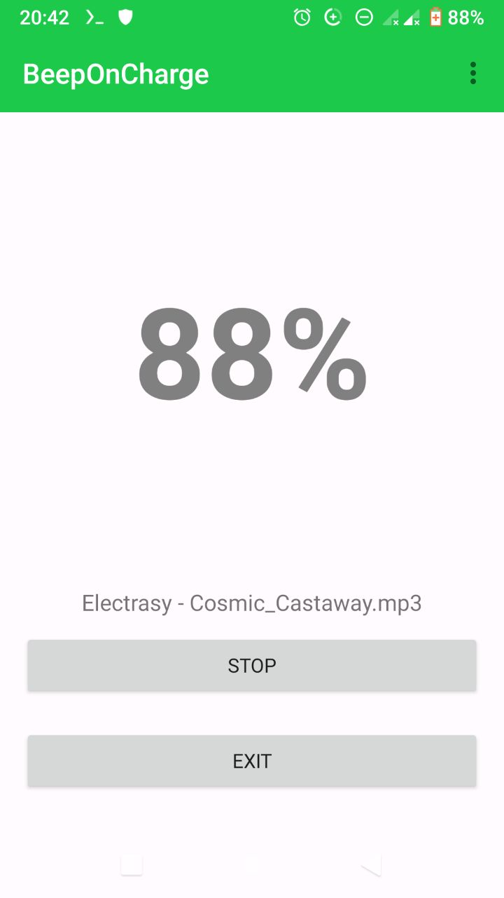
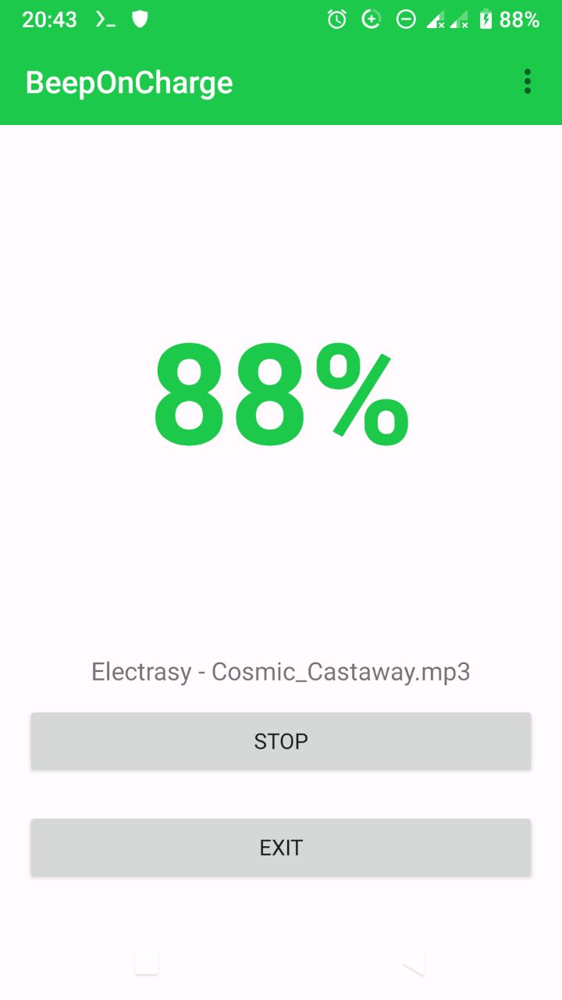
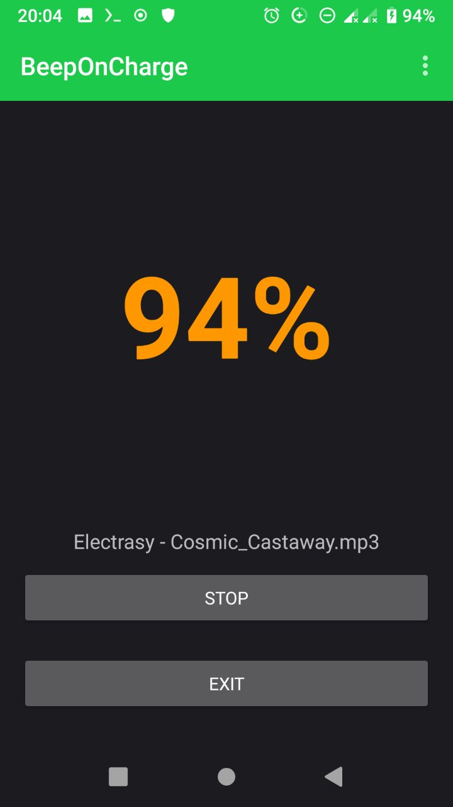

<h1>BeepOnCharge</h1>

Small Android app that plays a sound when the battery reaches a selected charge level.
- Android 9 (API 28) or newer
- Dark and light theme
- User can choose a custom sound and battery level

## Screenshots

| Light theme: not charging | Light theme: charging | Dark theme: reached charge level |
|-|-|-|
||||

## Thanks
<a href="https://www.flaticon.com/free-icon/battery_2961843" title="battery icons">Battery icons created by berkahicon - Flaticon</a>

